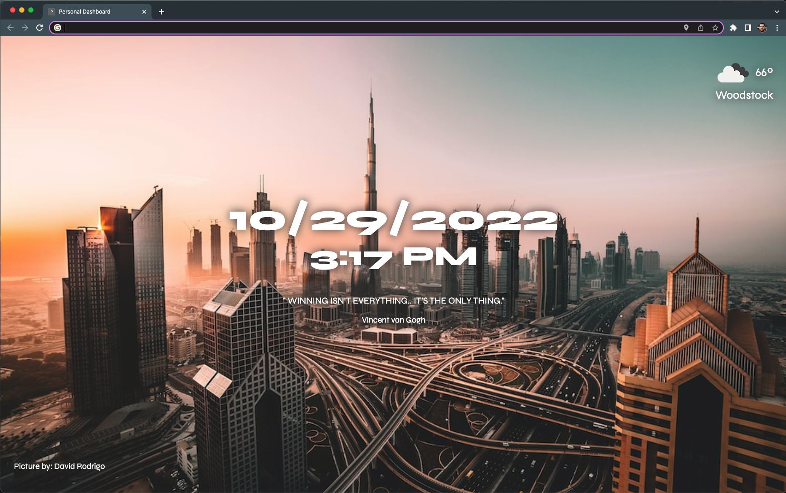

## Table of contents

- [Overview](#overview)
  - [Screenshot](#screenshot)
  - [Links](#links)
  - [Built with](#built-with)
- [Author](#author)

## Overview

### Making use of API calls to implement a personal dashboard in the shape of a Chrome extension.

- Geolocation to set the current weather conditions/city of user from OpenWeather API
- Interactive background image that changes automatically everytime user launches dashboard from Unsplash API
- Daily inspirational quote from They Say So Quotes API

### Screenshot

### Links

[Click Here For Live Site URL]()

### Built with

- Semantic HTML5 markup
- CSS custom properties
- Flexbox
- JavaScript

## Author

- Frontend Mentor - [@estebanp2022](https://www.frontendmentor.io/profile/estebanp2022)
